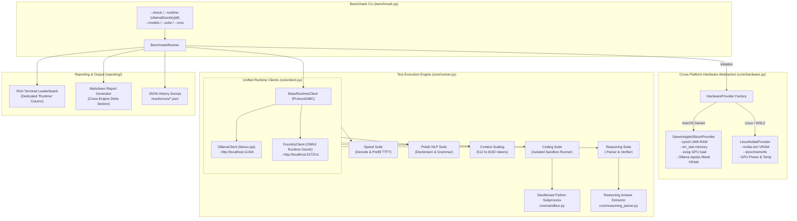

<div align="center">

# ⚡ Ollama BenchRig

**Cross-platform evaluation, hardware profiling, and benchmarking rig for local LLMs running on Ollama.**  
Tailored for **macOS Apple Silicon (M1/M2/M3/M4 Metal & Unified Memory)** and **Linux / WSL2 (NVIDIA GeForce RTX CUDA)**.

[](https://www.python.org/)
[](https://opensource.org/licenses/MIT)
[](https://ollama.com)
[]()
[](https://github.com/psf/black)

</div>

---

## 📌 Overview

**Ollama BenchRig** is an automated benchmarking and profiling suite that measures real-world code generation precision, logical reasoning, prompt prefill / generation speeds, context saturation, and hardware telemetry across local language models served via [Ollama](https://ollama.com) (`llama.cpp`) and **Microsoft Foundry Server Runtime** (**Foundry Local** / ONNX Runtime GenAI).

Unlike generic perplexity benchmarks, this suite focuses on **practical developer workloads**:
- **Executes code in isolated sandboxes** and checks deterministic unit test assertions.
- **Direct Cross-Runtime & Engine Comparison**: Benchmarks `llama.cpp` against Microsoft's ONNX Runtime GenAI side-by-side on identical hardware.
- **Analyzes reasoning models** (e.g. DeepSeek-R1) by inspecting `<think>` token patterns and extracting final answers.
- **Measures true Time to First Token (TTFT)** via high-precision streaming probes.
- **Monitors hardware saturation in real-time** (Metal buffer memory & GPU utilization on Apple Silicon; VRAM, power draw, and temperatures on NVIDIA).
- **Includes a zero-dependency Model Context Protocol (MCP) server** for instant agentic pairing in Antigravity, Cursor, or Claude Desktop.

---

## 🏗 System Architecture



---

## ✨ Key Features

| Feature | Description |
| :--- | :--- |
| 🚀 **Multi-Runtime Engine Support** | Evaluate models across **Ollama** (`llama.cpp`) and **Microsoft Foundry Local** (ONNX Runtime GenAI) with unified CLI and scoring. |
| ⏱ **High-Precision Timing** | Measures generation tokens/sec, prefill tokens/sec, and Time to First Token (TTFT) via nanosecond-precision streaming. |
| 💻 **Automated Sandboxed Coding** | Automatically extracts code blocks from LLM responses, wraps them with test harnesses, and executes them in isolated subprocesses against test assertions. |
| 🧠 **Reasoning & `<think>` Parser** | Detects whether models generate chain-of-thought blocks (`<think>...</think>`), calculates thinking token volume, and extracts final answers. |
| 📐 **Context Scaling (512 - 8k)** | Progressively loads larger contexts (512, 1024, 2048, 4096, 8192 tokens) to assess TTFT degradation and memory growth. |
| 📊 **Hardware Telemetry** | Samples GPU/UMA memory usage, GPU utilization %, temperatures, and power draw during execution without requiring root on macOS. |
| 🏆 **Leaderboard & Markdown Reports** | Produces Rich terminal tables with category medals (🥇, 🥈, 🥉), runtime indicators, and comparative Markdown summaries in `results/LATEST_SUMMARY.md`. |
| 🔌 **Built-in MCP Server** | Exposes local models (`qwen2.5-coder:7b`, `llama3.1:8b`, etc.) as tools for AI agents with zero cloud token cost. |

---

## 📚 Tutorials & Documentation

Comprehensive step-by-step tutorials and engineering deep dives are available in [`docs/`](docs/README.md):

### 🚀 Step-by-Step Hands-On Tutorials:
1. [**Tutorial 1: Quickstart Guide**](docs/tutorials/01_QUICKSTART_GUIDE.md) – Zero to benchmark in 5 minutes across macOS and Linux/WSL2.
2. [**Tutorial 2: Foundry GPU Setup (WSL2 / Linux)**](docs/tutorials/02_FOUNDRY_GPU_SETUP.md) – Complete guide for NVIDIA GPU acceleration on Microsoft Foundry Local (Cache Injection & Direct ONNX GenAI).
3. [**Tutorial 3: Fair 1:1 Cross-Engine Benchmarking**](docs/tutorials/03_CROSS_ENGINE_BENCHMARKING.md) – Standardizing parameters, cached baseline evaluation (`--baseline`), and scorecards.
4. [**Tutorial 4: Zero-Token-Cost Agent Integration**](docs/tutorials/04_AGENT_INTEGRATION_MCP.md) – Connecting local LLMs to coding agents (Antigravity, Claude Code, Cursor) with AST self-healing.
5. [**Tutorial 5: Authoring Custom Benchmark Scenarios**](docs/tutorials/05_CUSTOM_SCENARIO_AUTHORING.md) – Designing deterministic coding challenges, reasoning puzzles, and test harnesses.

### 📖 Technical Documentation Guides:
- [**System Architecture & Design**](docs/ARCHITECTURE.md) | [**CLI Reference & Options**](docs/CLI_USAGE.md) | [**Configuration Reference**](docs/CONFIGURATION.md)
- [**Foundry Local, CUDA & TensorRT Guide**](docs/FOUNDRY_WSL_CUDA_TENSORRT_GUIDE.md) | [**Hardware Telemetry**](docs/HARDWARE_TELEMETRY.md)
- [**Model Context Protocol (MCP) Integration**](docs/MCP_SERVER.md) | [**Benchmark Suites**](docs/BENCHMARK_SUITES.md) | [**Developer & Contributing Guide**](docs/DEVELOPER_GUIDE.md)

---

## 🚀 Quick Start

### Option A: macOS (Apple Silicon M1 / M2 / M3 / M4)

We provide an automated setup script that verifies your Apple Silicon chip, checks Python, creates a virtual environment, installs dependencies, and tests your Ollama connection:

```bash
git clone https://github.com/senssei/ollama-benchrig.git
cd ollama-benchrig

# Run the automated setup script:
chmod +x setup_mac.sh
./setup_mac.sh
```

### Option B: Linux / WSL2 (NVIDIA GeForce RTX)

```bash
git clone https://github.com/senssei/ollama-benchrig.git
cd ollama-benchrig

# Create virtual environment & install requirements
python3 -m venv .venv
source .venv/bin/activate
pip install -r requirements.txt

# Run environment diagnostic check
python3 benchmark.py --check
```

---

## 💻 CLI Usage & Examples

### 1. Diagnostic Environment Check
Verifies Ollama & MS Foundry Server connectivity, lists installed models across runtimes, and displays detected hardware:
```bash
python3 benchmark.py --check
```

### 2. Multi-Runtime & Cross-Engine Comparison
Compare models running under **Ollama** (`llama.cpp`) and **MS Foundry** (ONNX Runtime GenAI) head-to-head on the same hardware:
```bash
# Compare all installed models across both runtimes:
python3 benchmark.py --runtime all --models installed

# Compare specific models across engines:
python3 benchmark.py --models ollama:qwen2.5-coder:7b,foundry:phi-4

# Benchmark exclusively on Microsoft Foundry Server:
python3 benchmark.py --runtime foundry --models phi-4,qwen2.5-coder-7b
```

### 3. Benchmark Specific Models
```bash
python3 benchmark.py --models qwen2.5-coder:7b,llama3.1:8b
```

### 4. Run a Specific Test Suite
Available suites: `speed`, `coding`, `reasoning`, `polish`, `context`, `all`.
```bash
# Test only coding with automated unit tests (2 runs per model):
python3 benchmark.py --models qwen2.5-coder:7b --suite coding --runs 2

# Test context scaling up to 8k tokens:
python3 benchmark.py --models llama3.1:8b --suite context
```

### 5. Pull / Acquire Recommended Models
Downloads missing standard models from the respective Ollama or MS Foundry catalog:
```bash
python3 benchmark.py --pull-recommended
# Or specify runtime:
python3 benchmark.py --runtime foundry --pull-recommended
```

---

## ⚙️ Configuration (`config.yaml`)

Edit [config.yaml](config.yaml) to customize execution parameters, endpoints, and scoring weights:

```yaml
ollama:
  base_url: "http://localhost:11434"
  timeout_sec: 180
  warmup: true             # Pre-warms weights into memory before timing
  unload_after_test: true  # Keeps memory clean between model runs
  default_num_ctx: 4096

foundry:
  base_url: "http://localhost:5272/v1"  # Microsoft Foundry Local REST endpoint
  auto_detect_port: true                # Automatically queries active port via CLI
  cli_path: "foundry"                   # Optional Foundry Local CLI executable
  timeout_sec: 180
  warmup: true
  unload_after_test: true

benchmark:
  default_runs: 1
  default_runtime: "ollama"  # "ollama", "foundry", or "all"
  composite_weights:
    coding: 0.40           # 40% automated unit tests pass rate
    reasoning: 0.30        # 30% reasoning & logic ground truth
    performance: 0.30      # 30% normalized decode speed & memory efficiency

hardware:
  sample_interval_sec: 0.15
  # "auto" computes 88% of detected VRAM / Unified Memory
  vram_warning_threshold_mb: "auto"
```

---

## 🔌 Model Context Protocol (MCP) Server

The repository includes a lightweight stdio MCP server ([ollama_mcp_server.py](ollama_mcp_server.py)) that lets AI coding assistants (such as Google Antigravity, Cursor, or Claude Desktop) offload coding tasks to your local Ollama models with zero token cost.

### Available MCP Tools:
- `ask_local_coder(task, context_code, model)`: Fast code generation, algorithm implementation, or test writing.
- `local_code_review(code, focus)`: Static review and edge-case detection.
- `list_local_models()`: Query installed models and their memory footprints.

### Claude Desktop Configuration:
Add the following to your `~/Library/Application Support/Claude/claude_desktop_config.json` (macOS) or `%APPDATA%\Claude\claude_desktop_config.json` (Windows):

```json
{
  "mcpServers": {
    "ollama-local": {
      "command": "python3",
      "args": ["/path/to/ollama-benchrig/ollama_mcp_server.py"],
      "env": {
        "OLLAMA_HOST": "http://localhost:11434",
        "DEFAULT_MODEL": "qwen2.5-coder:7b"
      }
    }
  }
}
```

---

## 🤖 Antigravity Skills (`ollama-coder` & `foundry-coder`)

The repository includes ready-to-use **Antigravity Customization Skills** that equip AI coding agents with subcommands, model profiles, and an automated self-healing AST loop:

1. [**`ollama-coder`**](docs/OLLAMA_CODER_SKILL.md): Connects to local Ollama models (`qwen2.5-coder:7b`, `llama3.1:8b`).
2. [**`foundry-coder`**](docs/FOUNDRY_CODER_SKILL.md): Connects to Microsoft Foundry Local models (`phi-3.5-mini`, `qwen3-0.6b`).

### 1-Click Global Installation
```bash
# Install Ollama coder skill:
./install_global_skill.sh

# Install Microsoft Foundry coder skill:
./install_foundry_skill.sh
```

### CLI Usage
```bash
# Code generation with self-healing syntax loop (Ollama):
ask_local.py code --task "Implement a rate limiter" --output src/rate_limiter.py

# Code generation via Microsoft Foundry Local:
ask_foundry.py code --task "Implement a rate limiter" --output src/rate_limiter.py

# Automated unit test generation:
ask_local.py test --file src/rate_limiter.py --framework pytest

# Security and concurrency review:
ask_local.py review --file src/server.py --focus "race conditions and memory leaks"

# Refactoring with type hints and docstrings:
ask_local.py refactor --file src/util.py --type-hints --docstrings
```

### Standalone Distributable Package
Looking to publish or distribute independently? The standalone package is available in [`packages/antigravity-local-coder/`](packages/antigravity-local-coder/), complete with its own `plugin.json`, `mcp_config.json`, `install.sh`, and MIT license ready for its own GitHub repository.

---

## 🧪 Customizing Scenarios

Test cases are stored as clean JSON files inside the [scenarios/](scenarios/) directory:

- [scenarios/coding.json](scenarios/coding.json): Python coding tasks paired with test assertion arrays evaluated in sandbox subprocesses.
- [scenarios/reasoning.json](scenarios/reasoning.json): Multi-step math and logic puzzles with expected ground truth strings and regex patterns.
- [scenarios/speed.json](scenarios/speed.json): Raw generation and prefill throughput prompts.
- [scenarios/context_scaling.json](scenarios/context_scaling.json): Context scaling tests up to 8k tokens.
- [scenarios/polish.json](scenarios/polish.json): Multilingual tests checking Polish language morphology and syntax.

## 📚 Documentation

Detailed architecture, configuration guides, benchmark specifications, and operational manuals are available in the [`docs/`](docs/) directory:

| Document | Description |
| :--- | :--- |
| 🏛 [**System Architecture**](docs/ARCHITECTURE.md) | Deep dive into the Hardware Abstraction Layer (HAL), Runtime Abstraction Layer (RAL), sandbox isolation, and reporting pipeline. |
| 🚀 [**WSL2 CUDA & TensorRT Guide**](docs/FOUNDRY_WSL_CUDA_TENSORRT_GUIDE.md) | Complete guide to configuring Microsoft Foundry Local with NVIDIA CUDA and TensorRT acceleration on WSL2. |
| ⚙️ [**Configuration Reference**](docs/CONFIGURATION.md) | Full reference for `config.yaml`, environment variables (`OLLAMA_HOST`, `FOUNDRY_BASE_URL`), and dynamic port discovery. |
| 🧪 [**Benchmark Suites Mechanics**](docs/BENCHMARK_SUITES.md) | Evaluation methodology for Speed, Coding, Reasoning, Polish NLP, and Context Scaling suites. |
| 💻 [**CLI Usage & Recipes**](docs/CLI_USAGE.md) | Command-line parameters, scenario filtering, cross-engine flags, and automation scripts. |
| 📊 [**Hardware Telemetry & Profiling**](docs/HARDWARE_TELEMETRY.md) | Real-time GPU VRAM, compute load, Apple Silicon UMA memory, power draw, and temperature sampling. |
| 🤖 [**Local Coder Skill (Ollama)**](docs/LOCAL_CODER_SKILL.md) | Agent integration (`ask_local.py`), subcommands (`code`, `test`, `review`, `refactor`), and AST self-healing loop for Ollama. |
| 🤖 [**Foundry Coder Skill (MS Foundry)**](docs/FOUNDRY_CODER_SKILL.md) | Agent integration (`ask_foundry.py`), autonomous model loading, and AST self-healing for Microsoft Foundry Local. |
| 🔌 [**Model Context Protocol (MCP)**](docs/MCP_SERVER.md) | MCP server configuration, tool schemas, and integration for both `ollama-local` and `foundry-local`. |
| 📝 [**Scenario Authoring Guide**](docs/SCENARIOS_GUIDE.md) | Schema reference and instructions for creating custom coding, reasoning, and context scaling scenarios. |
| 👩‍💻 [**Developer & Contributing Guide**](docs/DEVELOPER_GUIDE.md) | Guide for adding runtime clients (`BaseRuntimeClient`), running test suites, and adhering to sandbox security. |

---

## 📁 Repository Structure

```
ollama-benchrig/
├── benchmark.py              # Main CLI entrypoint
├── config.yaml               # Global configuration (endpoints, weights, thresholds)
├── requirements.txt          # Python dependencies (rich, PyYAML, requests)
├── setup_mac.sh              # Quickstart installer for macOS Apple Silicon
├── install_global_skill.sh   # Global installer for local-coder (Ollama)
├── install_foundry_skill.sh  # Global installer for foundry-coder (MS Foundry)
├── LICENSE                   # MIT License
├── README.md                 # Project documentation
├── AGENTS.md                 # Guidelines and skill protocols for AI agents
├── ollama_mcp_server.py      # Zero-dependency stdio MCP server for Ollama
├── foundry_mcp_server.py     # Zero-dependency stdio MCP server for Microsoft Foundry Local
├── core/
│   ├── client.py             # Ollama & MS Foundry runtime clients with streaming TTFT probe
│   ├── hardware.py           # Cross-platform hardware providers (Darwin UMA / Linux CUDA)
│   ├── onnx_client.py        # Direct ONNX Runtime GenAI CUDA client (Option 3)
│   ├── runner.py             # Benchmark suite coordinator & scoring engine
│   ├── sandbox.py            # Sandboxed Python test harness runner
│   └── reasoning_parser.py   # <think> tag parser & answer extractor
├── docs/                     # Comprehensive documentation guides (11 guides + 5 tutorials)
│   ├── README.md             # Documentation & tutorials index
│   ├── ARCHITECTURE.md
│   ├── BENCHMARK_SUITES.md
│   ├── CLI_USAGE.md
│   ├── CONFIGURATION.md
│   ├── DEVELOPER_GUIDE.md
│   ├── FOUNDRY_CODER_SKILL.md
│   ├── FOUNDRY_WSL_CUDA_TENSORRT_GUIDE.md
│   ├── HARDWARE_TELEMETRY.md
│   ├── MCP_SERVER.md
│   ├── OLLAMA_CODER_SKILL.md
│   ├── SCENARIOS_GUIDE.md
│   └── tutorials/            # Hands-on step-by-step tutorials
│       ├── 01_QUICKSTART_GUIDE.md
│       ├── 02_FOUNDRY_GPU_SETUP.md
│       ├── 03_CROSS_ENGINE_BENCHMARKING.md
│       ├── 04_AGENT_INTEGRATION_MCP.md
│       └── 05_CUSTOM_SCENARIO_AUTHORING.md
├── packages/
│   └── antigravity-local-coder/ # Distributable standalone skill package
├── reporting/
│   ├── display.py            # Rich terminal banners and leaderboard UI
│   └── markdown.py           # Comprehensive Markdown report generator
├── scenarios/                # Test scenario definitions (JSON)
│   ├── coding.json
│   ├── context_scaling.json
│   ├── polish.json
│   ├── reasoning.json
│   └── speed.json
├── examples/
│   ├── calculator.py         # Sample module for test generation benchmarks
│   └── run_onnx_gpu.py       # Standalone direct ONNX GenAI CUDA runner
├── results/
│   ├── 1TO1_COMPARISON_REPORT.md # Cross-engine comparative report
│   ├── LATEST_SUMMARY.md     # Latest benchmark Markdown report
│   ├── latest.json           # Latest scorecard JSON
│   └── runs/                 # Historical benchmark runs
└── tests/                    # 100% offline unit test suite (63 unit tests)
    ├── test_ask_local.py
    ├── test_foundry_mcp_and_skill.py
    ├── test_foundry_runtime.py
    ├── test_hardware.py
    ├── test_onnx_client.py
    └── test_token_savings.py
```

---

## 📄 License

This project is licensed under the **MIT License** - see the [LICENSE](LICENSE) file for details.
