# 🏗 System Architecture & Engine Design

This document details the internal architecture, design principles, and abstraction layers powering **BenchRig**.

---

## 1. High-Level Architecture

BenchRig is designed around a modular, decoupled architecture where runtime backends, hardware profilers, test scenarios, and reporting sinks operate behind strict abstract interfaces:

```mermaid
flowchart TD
    CLI["CLI Layer\n(benchrig/cli.py)"] --> Runner["BenchmarkRunner Engine\n(benchrig/core/runner.py)"]
    
    subgraph HardwareAbstraction ["Hardware Abstraction Layer (HAL)"]
        Runner --> HAL["HardwareProvider Factory\n(benchrig/core/hardware.py)"]
        HAL --> Darwin["DarwinAppleSiliconProvider\n(Metal 3, sysctl, vm_stat, ioreg)"]
        HAL --> Linux["LinuxNvidiaProvider\n(CUDA, nvidia-smi, /proc/meminfo)"]
    end

    subgraph RuntimeAbstraction ["Runtime Abstraction Layer (RAL)"]
        Runner --> RAL["BaseRuntimeClient Protocol\n(benchrig/core/client.py)"]
        RAL --> Ollama["OllamaClient\n(llama.cpp native REST API)"]
        RAL --> Foundry["FoundryClient\n(ONNX Runtime GenAI OpenAI API)"]
        RAL --> OnnxGPU["OnnxGenAiClient\n(Direct Python ONNX GenAI CUDA)"]
    end

    subgraph EvaluationPipelines ["Scenario Evaluation Pipelines"]
        Runner --> Speed["Speed & Latency\n(Streaming TTFT Probes)"]
        Runner --> Coding["Coding Suite\n(benchrig/core/sandbox.py Subprocess Harness)"]
        Runner --> Reasoning["Reasoning Suite\n(benchrig/core/reasoning_parser.py)"]
        Runner --> Context["Context Saturation\n(512 - 8192 window sweep)"]
        Runner --> Polish["Polish NLP Suite\n(Linguistic verification)"]
    end

    subgraph OutputSinks ["Reporting & Sinks (benchrig/reporting/)"]
        Runner --> Rich["Rich Terminal Display\n(benchrig/reporting/display.py)"]
        Runner --> Markdown["Markdown Generator\n(benchrig/reporting/markdown.py)"]
        Runner --> Storage["JSON Run Storage\n(results/runs/*.json)"]
    end
```



---

## 2. Core Abstraction Layers

### A. Runtime Abstraction Layer (`BaseRuntimeClient`)
Located in [`benchrig/core/client.py`](../benchrig/core/client.py) and [`benchrig/core/onnx_client.py`](../benchrig/core/onnx_client.py), this base class decouples test execution from the underlying inference engine:

```python
class BaseRuntimeClient:  # required methods raise NotImplementedError; load/unload/pull have safe defaults
    name: str  # 'ollama' | 'foundry' | 'onnx-gpu'
    engine_name: str  # 'llama.cpp' | 'ONNX Runtime GenAI'
    base_url: str

    def is_reachable(self) -> bool: ...

    def get_version(self) -> str: ...

    def list_installed_models(self) -> List[Dict[str, Any]]: ...

    def load_model(self, model: str) -> bool: ...

    def unload_model(self, model: str) -> bool: ...

    def pull_model(self, model: str) -> bool: ...

    def generate(
        self,
        model: str,
        prompt: str,
        system: Optional[str] = None,
        options: Optional[Dict[str, Any]] = None,
        measure_ttft: bool = True,
    ) -> Dict[str, Any]: ...
```

#### Key Implementation Details:
* **`OllamaClient`**: Communicates directly with `http://localhost:11434/api/generate` and `/api/tags`. Extracts native nanosecond timing metadata (`prompt_eval_duration`, `eval_duration`) generated by `llama.cpp`.
* **`FoundryClient`**: Communicates with the local OpenAI-compatible REST server spawned by `foundrylocald`. Implements Server-Sent Events (SSE) stream parsing to measure exact client-side Time-to-First-Token (TTFT) and throughput. Features zero-latency port auto-discovery via `~/.foundry/daemon.json` and supports **Option 2 CUDA Cache Injection**.
* **`OnnxGenAiClient`**: High-performance direct Python C-API bindings to `onnxruntime-genai-cuda` (**Option 3**). Bypasses the background daemon to load HuggingFace ONNX INT4 AWQ models directly into NVIDIA VRAM with zero HTTP overhead.

---

### B. Hardware Abstraction Layer (`HardwareProvider`)
Located in [`benchrig/core/hardware.py`](../benchrig/core/hardware.py), this layer measures real-time physical resource saturation during model evaluation without requiring root or elevated privileges:

1. **`DarwinAppleSiliconProvider`**:
   - Total & Available Unified Memory (UMA) via `sysctl -n hw.memsize` and `vm_stat`.
   - Apple Silicon GPU active load percentage via `ioreg -r -d 1 -w 0 -c IOAccelerator`.
   - VRAM buffer allocations per model queried via Ollama's `/api/ps` Metal buffer endpoints.
2. **`LinuxNvidiaProvider`**:
   - Dedicated VRAM consumption, GPU utilization %, temperatures, and power draw sampled via `nvidia-smi` CSV queries.
   - Host system RAM telemetry sampled via `/proc/meminfo`.

---

### C. Sandboxed Execution Engine (`benchrig/core/sandbox.py`)
To prevent LLM hallucination from invalidating coding benchmarks, the sandbox:
1. Strips markdown backticks, conversational preambles, and conversational suffixes via AST regex heuristics.
2. Synthesizes a self-contained Python test script combining the model's implementation with strict unit test assertions.
3. Spawns an isolated `subprocess.run` with a rigid timeout (10 seconds) and restricted resource limits.
4. Returns granular diagnostics: standard output, tracebacks, passed assertion counts, and syntax error classifications.

---

## 3. Configuration Hierarchy

The system loads settings hierarchically:
1. **Defaults**: Hardcoded safe fallbacks in `benchrig/core/config.py`.
2. **Configuration File**: [`config.yaml`](../benchrig/data/config.yaml) in the workspace root specifying endpoints, default models, timeouts, and thresholds.
3. **CLI Arguments**: Runtime flags passed to [`benchrig`](../benchrig/cli.py) override file configuration dynamically.
