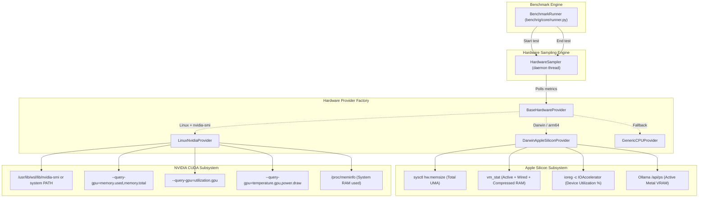

# 📊 Hardware Telemetry & Real-Time Profiling

This guide details the internal design, telemetry capture mechanisms, and cross-platform metrics gathered by **BenchRig**'s Hardware Abstraction Layer ([`benchrig/core/hardware.py`](../benchrig/core/hardware.py)).

---

## 🏛 Architecture Overview

BenchRig provides real-time hardware telemetry without requiring administrative (`root` / `sudo`) privileges. It features a non-blocking, background sampling architecture capable of profiling:
- **macOS Apple Silicon (M1/M2/M3/M4)**: Unified Memory Architecture (UMA) consumption, Metal VRAM residency, and IOAccelerator GPU core load.
- **Linux / WSL2 (NVIDIA GeForce RTX / Data Center GPUs)**: Dedicated VRAM allocation, GPU core compute utilization, operating temperatures, and electrical power draw via NVML / `nvidia-smi`.
- **Generic CPU Systems**: Host memory footprint, CPU model extraction, and core topology.



---

## 🍎 macOS Apple Silicon Telemetry Mechanics

Apple Silicon unified memory pools system RAM and GPU VRAM dynamically. Standard Linux tools like `free` or `/proc` do not exist, and root-only utilities like `powermetrics` cannot be run by unprivileged users. BenchRig circumvents this using native POSIX and Darwin interfaces:

### 1. Unified Memory (UMA) Capacity & Usage
- **Total Physical Memory**: Queried via `sysctl -n hw.memsize`.
- **Active Memory Consumption**: Analyzed from `vm_stat` output using the exact Darwin memory formula:
  $$\text{Used RAM (Bytes)} = (\text{Pages Wired} + \text{Pages Active} + \text{Pages Compressed}) \times \text{Page Size}$$
  Page size is dynamically resolved (typically $16,384\text{ bytes}$ on Apple Silicon).
- **Metal Model VRAM Residency**: BenchRig queries the Ollama daemon via `GET /api/ps` to determine the exact number of bytes mapped directly to Metal GPU buffers for active model weights.

### 2. GPU Core Utilization
- Real-time GPU compute load is polled via the I/O Kit registry without elevated permissions:
  ```bash
  ioreg -r -d 1 -w 0 -c IOAccelerator
  ```
  The sampler parses `"Device Utilization %"` from the resulting registry tree.

---

## 🐧 Linux & WSL2 NVIDIA Telemetry Mechanics

On Linux and Windows Subsystem for Linux (WSL2), BenchRig interfaces directly with NVIDIA drivers.

### 1. Robust `nvidia-smi` Discovery
In WSL2 environments, standard binaries often live outside traditional `$PATH` directories. BenchRig traverses standard locations in priority order:
1. Shell `$PATH` lookup via `shutil.which("nvidia-smi")`.
2. WSL2 driver mount point: `/usr/lib/wsl/lib/nvidia-smi`.
3. Standard Linux path: `/usr/bin/nvidia-smi`.

### 2. Monitored NVIDIA Metrics
During benchmark runs, the sampler executes low-overhead batched queries:
```bash
nvidia-smi --query-gpu=memory.used,memory.total,utilization.gpu,temperature.gpu,power.draw --format=csv,noheader,nounits
```
- **VRAM Allocated (`memory.used`)**: Exact framebuffer memory currently occupied by model layers, KV cache, and context buffers.
- **Compute Load (`utilization.gpu`)**: Real-time CUDA kernel occupancy percentage.
- **Operating Temperature (`temperature.gpu`)**: Sensor temperature in degrees Celsius (°C).
- **Power Consumption (`power.draw`)**: Real-time electrical power draw in Watts (W).

### 3. Host System Memory
Host RAM is parsed directly from `/proc/meminfo`:
$$\text{Used RAM} = \text{MemTotal} - \text{MemAvailable}$$

---

## 🧵 The `HardwareSampler` Thread

To capture accurate peak metrics during inference without skewing execution times:

1. **Non-Blocking Daemon Execution**:
   When a benchmark starts, `HardwareSampler.start()` spawns a daemon thread `_worker()` that loops at the configured interval (`hardware.sample_interval_sec: 0.15`).
2. **Atomic Samples**:
   The thread collects time-series arrays for:
   - `vram_samples` (MB)
   - `gpu_util_samples` (%)
   - `temp_samples` (°C)
   - `power_samples` (Watts)
   - `ram_used_samples` (GB)
3. **Statistical Aggregation**:
   Upon test completion, `HardwareSampler.stop()` terminates the thread and returns aggregated statistics:
   - **Peak VRAM / UMA**: Maximum memory consumed during generation.
   - **Average GPU Utilization**: Mean GPU activity throughout prefill and decode stages.
   - **Average Power Draw & Temperature**: Thermal and energy profile during sustained inference.
   - **Peak Memory Delta**: Net memory increase from pre-test idle to generation peak.

---

## ⚠️ VRAM Warning & Headroom Thresholds

To prevent catastrophic out-of-memory crashes or OS-level paging thrashing:
- The default configuration uses `vram_warning_threshold_mb: "auto"`.
- The threshold is computed dynamically as **88% of total detected memory**:
  $$\text{Threshold} = \text{Total Memory (MB)} \times 0.88$$
- When peak usage exceeds this threshold, the runner flags the result with a warning indicator (`⚠️ High VRAM`) in both terminal and Markdown reports, indicating that larger context windows or concurrent processes may risk OOM eviction.
