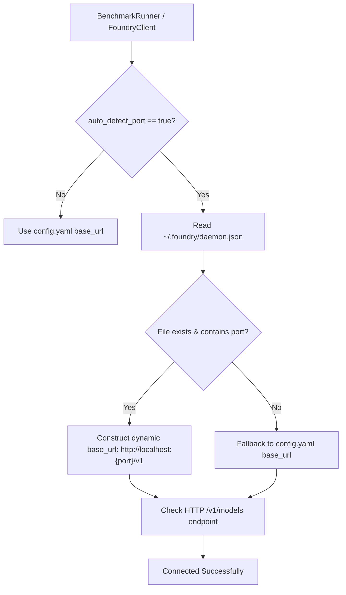

# ⚙️ Configuration Reference Guide

This document provides a comprehensive reference for configuring **BenchRig** via [`config.yaml`](https://github.com/senssei/benchrig/blob/main/benchrig/data/config.yaml) and environment variables.

---

## 📋 Configuration File Overview (`config.yaml`)

BenchRig uses a centralized YAML configuration file to control runtime connectivity, timeout thresholds, benchmark execution defaults, hardware telemetry sampling, and composite scoring formulas.

```yaml
# ==============================================================================
# BenchRig - Global Runtime & Benchmark Configuration
# ==============================================================================

ollama:
  base_url: "http://localhost:11434"
  timeout_sec: 180
  warmup: true             # Pre-warms weights into VRAM before timing
  unload_after_test: true  # Evicts model from VRAM between benchmark runs
  default_num_ctx: 4096    # Default context window size

foundry:
  base_url: "http://localhost:5272/v1"  # Default Microsoft Foundry Local endpoint
  auto_detect_port: true                # Reads active port from ~/.foundry/daemon.json
  cli_path: "foundry"                   # Foundry CLI binary name or absolute path
  timeout_sec: 180
  warmup: true
  unload_after_test: true

prism:
  base_url: "http://127.0.0.1:5272/v1"  # Prism server (`prism serve`)
  timeout_sec: 180
  warmup: true
  unload_after_test: false              # Prism loads on demand; nothing to unload

onnx:
  # models_dir: defaults to $BENCHRIG_MODEL_DIRS, then ./models, then ~/.benchrig/models
  timeout_sec: 300
  default_max_tokens: 4096

benchmark:
  default_runs: 1                       # Number of benchmark iterations per test
  default_runtime: "ollama"             # Default runtime: "ollama", "foundry", "onnx-gpu", "prism" or "all"
  composite_weights:
    coding: 0.40                        # 40% weight for coding unit test pass rate
    reasoning: 0.30                     # 30% weight for reasoning ground-truth accuracy
    performance: 0.30                   # 30% weight for normalized throughput & TTFT

hardware:
  sample_interval_sec: 0.15             # Telemetry polling frequency (seconds)
  vram_warning_threshold_mb: "auto"     # "auto" defaults to 88% of detected VRAM/UMA
```

---

## 🔧 Section-by-Section Reference

### 1. `ollama` Configuration

Controls connectivity and lifecycle management for the local [Ollama](https://ollama.com) daemon (`llama.cpp` backend).

| Parameter | Type | Default | Description |
| :--- | :--- | :--- | :--- |
| `base_url` | `string` | `"http://localhost:11434"` | Base URL where the Ollama HTTP REST API is listening. Overridden by `OLLAMA_HOST` if defined. |
| `timeout_sec` | `integer` | `180` | Maximum socket timeout in seconds for prompt generation and model pulling requests. |
| `warmup` | `boolean` | `true` | When `true`, executes a non-timed single-token prompt before benchmarking to ensure model weights and KV cache are loaded into VRAM/UMA. |
| `unload_after_test` | `boolean` | `true` | When `true`, explicitly unloads the model from memory after each test iteration by issuing a request with `keep_alive: 0`. Prevents VRAM fragmentation. |
| `default_num_ctx` | `integer` | `4096` | Default context window length in tokens allocated for inference requests unless explicitly overridden by a scenario. |

---

### 2. `foundry` Configuration

Controls connectivity, execution provider negotiation, and port discovery for **Microsoft Foundry Local** (`ONNX Runtime GenAI` backend).

| Parameter | Type | Default | Description |
| :--- | :--- | :--- | :--- |
| `base_url` | `string` | `"http://localhost:5272/v1"` | Fallback endpoint for Foundry Local OpenAI-compatible REST server. |
| `auto_detect_port` | `boolean` | `true` | When `true`, reads the dynamic listening port and endpoint URL directly from `~/.foundry/daemon.json`. Prevents connection failures when Foundry starts on ephemeral ports (e.g. 51834, 5272). |
| `cli_path` | `string` | `"foundry"` | Path to the `foundry` CLI executable. Can be a bare command name (if located in `$PATH`) or an absolute path (e.g. `~/.local/bin/foundry`). |
| `timeout_sec` | `integer` | `180` | Request timeout in seconds for Foundry completions and model queries. |
| `warmup` | `boolean` | `true` | Warms up ONNX graph execution and execution provider memory pools prior to recorded benchmark runs. |
| `unload_after_test` | `boolean` | `true` | Releases model session from memory between runs to ensure clean hardware telemetry. |

---

### 2b. `prism` Configuration

Controls the connection to a [Prism](https://github.com/senssei/prism-local) server (`prism serve`), which fronts ONNX Runtime GenAI
(CUDA or CPU) and Ollama behind one OpenAI-compatible endpoint. The endpoint is always explicit: it is never auto-discovered
and the `foundry` CLI is never used. See [Runtimes](runtimes.md#prism).

| Parameter | Type | Default | Description |
| :--- | :--- | :--- | :--- |
| `base_url` | `string` | `"http://127.0.0.1:5272/v1"` | Prism's OpenAI-compatible endpoint. |
| `api_key` | `string` | *(unset)* | Bearer token, if the server was started with `--api-key`. Prefer the `PRISM_API_KEY` environment variable over writing a key into the file. |
| `cli_path` | `string` | `"prism"` | `prism` executable used by `--pull-recommended` (`prism pull <model>`). |
| `timeout_sec` | `integer` | `180` | Request timeout in seconds. |
| `warmup` | `boolean` | `true` | Sends a warm-up request before the recorded runs. |
| `unload_after_test` | `boolean` | `false` | Prism loads models on demand and has nothing to unload, so this is off by default. |
| `default_max_tokens` | `integer` | `4096` | Completion limit when a scenario does not set one. |

---

### 3. `benchmark` Configuration

Controls test orchestration, iteration counts, and composite score weighting.

| Parameter | Type | Default | Description |
| :--- | :--- | :--- | :--- |
| `default_runs` | `integer` | `1` | Default number of iterations executed per test scenario. When greater than 1, metrics (throughput, TTFT, memory) are averaged. |
| `default_runtime` | `string` | `"ollama"` | Target runtime engine when `--runtime` is omitted on the CLI. Supported values: `"ollama"`, `"foundry"`, `"onnx-gpu"`, `"prism"`, `"all"`. |
| `composite_weights.coding` | `float` | `0.40` | Relative weighting (0.0 to 1.0) of automated unit test execution pass rate in the final composite score. |
| `composite_weights.reasoning` | `float` | `0.30` | Relative weighting (0.0 to 1.0) of multi-step logical deduction and mathematical ground truth accuracy. |
| `composite_weights.performance`| `float` | `0.30` | Relative weighting (0.0 to 1.0) of generation throughput, prefill throughput, and low Time to First Token (TTFT). |
| `thinking_models` | `list of string` | `["deepseek-r1", "qwq", "magistral", "qwen3"]` | Models that think before answering. Matched as case-insensitive substrings of the model name. Their `num_predict` is multiplied on the coding, reasoning and polish suites (speed and context are unchanged). |
| `thinking_token_multiplier` | `integer` | `12` | Factor applied to `num_predict` for `thinking_models`, so the answer or the code is not cut off inside the `<think>` trace. `1` disables it. It also applies where thinking is switched off (`think: false`), because a thinking-capable model was measured running into the base budget without it. |
| `think` | `map suite -> true/false` | `{speed: false, context: false}` | Ollama's `think` option per suite (`speed`, `context`, `coding`, `reasoning`, `polish`) for models that Ollama lists as able to think. Omit a suite to use the model's own default. A scenario's `options.think` overrides it. Sent only to thinking-capable models; other runtimes ignore it. |

#### Composite Score Calculation Formula
$$\text{Composite Score} = (W_{\text{code}} \times \text{PassRate}) + (W_{\text{reason}} \times \text{Accuracy}) + (W_{\text{perf}} \times \text{ThroughputFactor})$$

Where:
- $\text{PassRate} = \frac{\text{Passed Coding Tests}}{\text{Total Coding Tests}} \times 100$
- $\text{Accuracy} = \frac{\text{Passed Reasoning Tests}}{\text{Total Reasoning Tests}} \times 100$
- $\text{ThroughputFactor} = \min\left(100, \frac{\text{Eval Tokens/sec}}{80} \times 100\right)$

---

### 4. `onnx` Configuration (Direct ONNX Runtime GenAI)

Controls direct execution through Python bindings to `onnxruntime-genai-cuda` (**Option 3**).

| Parameter | Type | Default | Description |
| :--- | :--- | :--- | :--- |
| `models_dir` | `string` | *(unset)* | Directory with ONNX model folders. When unset: `$BENCHRIG_MODEL_DIRS` (first entry), then `./models` if it exists, then `~/.benchrig/models`. |
| `timeout_sec` | `integer` | `300` | Execution timeout in seconds for direct ONNX generation. |
| `default_max_tokens` | `integer` | `4096` | Max tokens limit for generation. |
| `warmup` | `boolean` | `true` | Warms up ONNX graph execution and allocator pools before timing. |
| `unload_after_test` | `boolean` | `true` | Releases model session from memory between runs. |

---

### 5. `execution_alignment_1to1` Configuration

Default sampling for **every** request on **every** runtime, so cross-engine comparisons use the same parameters. A scenario's own
`options` always win over these values.

```yaml
execution_alignment_1to1:
  context_tokens: 4096     # default num_ctx
  temperature: 0.1         # low temperature for deterministic code
  top_p: 0.9               # standard nucleus sampling
  seed: 42                 # base RNG seed; repetition N of `--runs` uses seed + N
```

Repetitions (`--runs N`) use different seeds, and every repetition after the first sends its prompts with a short marker in front
(`(request 2)`), because Ollama caches the prompt prefix between requests (a repeated prompt measured 0.006 s of prefill instead
of 0.12 s), which would make later repetitions look faster. Remove the section to send only what the scenarios specify.

---

### 6. `model_pairs_1to1` Configuration

Defines cross-engine 1:1 comparison pairs between Ollama and Microsoft Foundry Local / ONNX GenAI:

| Pair ID | Architecture | Ollama Model | Foundry Model | Recommended Suite |
| :--- | :--- | :--- | :--- | :--- |
| `phi_mini` | Phi-3 / 3.5 Mini (3.8B) | `phi3:mini` | `phi-3.5-mini` | `coding` |
| `phi4_mini` | Phi-4 Mini (3.8B) | `phi4-mini:latest` | `phi-4-mini` | `coding` |
| `qwen_coder_7b` | Qwen 2.5 Coder 7B | `qwen2.5-coder:7b` | `qwen2.5-coder-7b` | `coding` |
| `qwen_small` | Qwen 3 (0.5B - 0.6B) | `qwen2.5:0.5b` | `qwen3-0.6b` | `coding` |

---

A pair may also carry `onnx:` (direct ONNX model name) and `prism:` (model name on a Prism server) keys. With `--baseline`, `--runtime onnx-gpu` uses `onnx:` (else `foundry:`) and `--runtime prism` uses `prism:` (else `onnx:`, else `foundry:`).

---

### 6b. `recommended_models` Configuration

Model lists per runtime (`ollama`, `foundry`, `prism`) that `--pull-recommended` downloads when they are not installed yet. A flat list is accepted for backward compatibility and means Ollama. Direct ONNX models are not pulled; download them with `huggingface-cli` instead.

```yaml
recommended_models:
  ollama: ["qwen2.5-coder:7b", "llama3.1:8b"]
  prism: ["phi-4-mini"]        # pulled with `prism pull`
  foundry: ["phi-3.5-mini"]
```

---

### 7. `hardware` Configuration

Controls the background hardware sampling thread and memory capacity warning thresholds.

| Parameter | Type | Default | Description |
| :--- | :--- | :--- | :--- |
| `sample_interval_sec` | `float` | `0.15` | Polling frequency in seconds for hardware monitoring threads (`DarwinAppleSiliconProvider` and `LinuxNvidiaProvider`). Balanced to capture transient spikes without consuming measurable CPU cycles. |
| `vram_warning_threshold_mb` | `string` \| `integer` | `"auto"` | Memory threshold at which BenchRig issues a visual alert in terminal and reports. When set to `"auto"`, the runner calculates $88\%$ of detected VRAM or Unified Memory. Can also be set to a fixed integer in megabytes (e.g. `10240` for 10 GB). |

---

## 🌐 Environment Variables

Environment variables take precedence over settings defined in `config.yaml`:

| Variable | Target Parameter | Description |
| :--- | :--- | :--- |
| `OLLAMA_HOST` | `ollama.base_url` | Full URL or host:port where Ollama is reachable (e.g. `http://192.168.1.100:11434` or `127.0.0.1:11434`). |
| `FOUNDRY_BASE_URL` | `foundry.base_url` | Overrides the base URL for the Microsoft Foundry REST endpoint. |
| `PRISM_API_KEY` | `prism.api_key` | Bearer token for a Prism server started with `--api-key`. |
| `BENCHRIG_CONFIG` | config file | Path of the config file to use when `--config` is not given (lookup: `--config`, `$BENCHRIG_CONFIG`, `./config.yaml`, bundled default). |
| `BENCHRIG_MODEL_DIRS` | `onnx.models_dir` | Where direct ONNX models are looked up (first entry; then `./models`, then `~/.benchrig/models`). |
| `LD_LIBRARY_PATH` | System Dynamic Linker | Must include paths to CUDA, cuDNN, and TensorRT shared objects (`.so`) when running on Linux / WSL2. |
| `CUDA_VISIBLE_DEVICES` | System GPU Index | Restricts GPU enumeration to specific device indices (e.g. `CUDA_VISIBLE_DEVICES=0`). |

---

## 🔄 Dynamic Port Auto-Discovery Workflow

When Microsoft Foundry Local daemon starts, it may bind to an ephemeral port to avoid conflicts. With `auto_detect_port: true`, BenchRig locates the daemon configuration file:



---

## 🧹 Memory Management & VRAM Hygiene

Running multiple large language models sequentially can cause out-of-memory (OOM) faults or memory fragmentation if previous models linger in VRAM:

1. **Pre-test Warmup (`warmup: true`)**:
   Sends a minimal generation query (`"hi"`) to trigger model loading and weight caching before timing begins, preventing model loading I/O latency from corrupting TTFT and decode throughput benchmarks.
2. **Post-test Unload (`unload_after_test: true`)**:
   - **Ollama**: Sends `{"model": "<name>", "keep_alive": 0}` to the `/api/generate` endpoint, instructing Ollama to immediately evict the model weights from GPU memory.
   - **Foundry Local**: Signals model session teardown to reset execution provider allocator pools.
